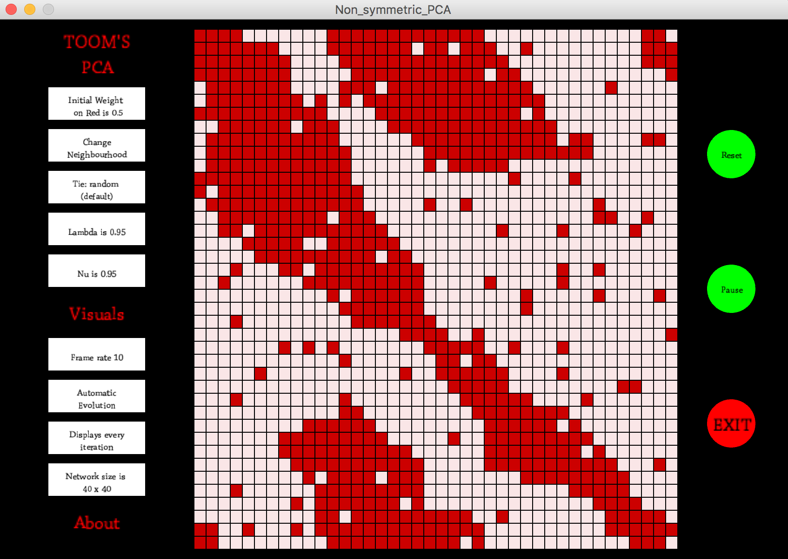

# ToomPCA

PCA with cells whose colours change depending on the average of some neighbourhood, with error as a parameter. 

These can be used to see non-uniqueness of the future. Particularly for the two-state system, low error rate leads to all the square becoming either one or the other colour. For a very high error rate, the colours will alternate, but after any long time T either colour can be dominating.

This repository contains folders for the 2-state PCA ('Non_symmetric_PCA'), and a 3-state PCA ('PCA_Three_v3'). I suspect the reason the latter is v3 is that there were more ways to construct a 3-state version, and this is only one of them.

The particulars of parameters can be found within each folder, as well as in the 'About' screen within the app itself.

This was written in ProcessingV2 and modified for ProcessingV3. 

